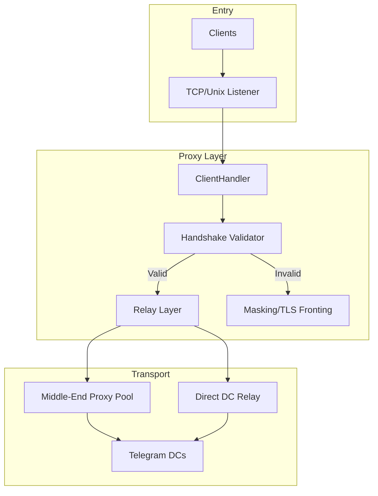

# Architect Mode Rules for Telemt

## Architecture Overview

## Module Dependencies
- [`src/main.rs`](src/main.rs) - Entry point, spawns all async tasks
- [`src/config/`](src/config/) - Configuration loading with auto-migration
- [`src/error.rs`](src/error.rs) - Error types, must be used by all modules
- [`src/crypto/`](src/crypto/) - AES, SHA, random number generation
- [`src/protocol/`](src/protocol/) - MTProto constants, frame encoding, obfuscation
- [`src/stream/`](src/stream/) - Stream wrappers, buffer pool, frame codecs
- [`src/proxy/`](src/proxy/) - Client handling, handshake, relay logic
- [`src/transport/`](src/transport/) - Upstream management, middle-proxy, SOCKS support
- [`src/stats/`](src/stats/) - Statistics and replay protection
- [`src/ip_tracker.rs`](src/ip_tracker.rs) - Per-user IP tracking

## Key Architectural Constraints

### Middle-End Proxy Mode
- Requires public IP on interface OR 1:1 NAT with STUN probing
- Uses separate `proxy-secret` from Telegram (NOT user secrets)
- Falls back to direct mode automatically on STUN mismatch

### TLS Fronting
- Invalid handshakes are transparently proxied to `mask_host`
- This is critical for DPI evasion - do not change this behavior
- `mask_unix_sock` and `mask_host` are mutually exclusive

### Stream Architecture
- Buffer pool is shared globally via Arc - prevents allocation storms
- Frame codecs implement tokio-util Encoder/Decoder traits
- State machine in [`src/stream/state.rs`](src/stream/state.rs) manages stream transitions

### Configuration Migration
- [`ProxyConfig::load()`](src/config/mod.rs:641) mutates config in-place
- New fields must have sensible defaults
- DC203 override is auto-injected for CDN/media support
