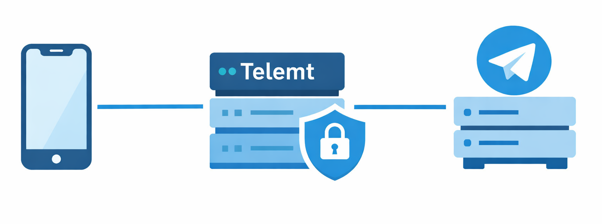

# Telemt — MTProxy на Rust + Tokio

***Решает проблемы раньше, чем другие узнают об их существовании***

> [!Примечание]
>
> Исправленный TLS ClientHello доступен в **Telegram Desktop** начиная с версии **6.7.2**: для работы с EE-MTProxy обновите клиент.
>
> Исправленный TLS ClientHello для Telegram Android доступен в нашем чате; **официальные релизы для Android и iOS находятся в процессе разработки**.

<p align="center">
  <a href="https://t.me/telemtrs">
    
  </a>
</p>

**Telemt** — это быстрый, безопасный и функциональный сервер, написанный на Rust. Он полностью реализует официальный алгоритм прокси Telegram и добавляет множество улучшений для продакшена:

- [ME Pool + Reader/Writer + Registry + Refill + Adaptive Floor + Trio-State + жизненный цикл генераций](https://github.com/telemt/telemt/blob/main/docs/model/MODEL.en.md);
- [Полноценный API с управлением](https://github.com/telemt/telemt/blob/main/docs/API.md);
- Защита от повторных атак (Anti-Replay on Sliding Window);
- Метрики в формате Prometheus;
- TLS-fronting и TCP-splicing для маскировки от DPI.



## Особенности

⚓ Реализация **TLS-fronting** максимально приближена к поведению реального HTTPS-трафика.

⚓ ***Middle-End Pool*** оптимизирован для высокой производительности.

- Поддержка всех режимов MTProto proxy:
  - Classic;
  - Secure (префикс `dd`);
  - Fake TLS (префикс `ee` + SNI fronting);
- Защита от replay-атак;
- Маскировка трафика (перенаправление неизвестных подключений на реальные сайты);
- Настраиваемые keepalive, таймауты, IPv6 и «быстрый режим»;
- Корректное завершение работы (Ctrl+C);
- Подробное логирование через `trace` и `debug`.

# Навигация
- [FAQ](#faq)
- [Архитектура](docs/Architecture)
- [Быстрый старт](#quick-start-guide)
- [Параметры конфигурационного файла](docs/Config_params)
- [Сборка](#build)
- [Почему Rust?](#why-rust)
- [Известные проблемы](#issues)
- [Планы](#roadmap)

## Быстрый старт
- [Quick Start Guide RU](docs/Quick_start/QUICK_START_GUIDE.ru.md)
- [Quick Start Guide EN](docs/Quick_start/QUICK_START_GUIDE.en.md)

## FAQ

- [FAQ RU](docs/FAQ.ru.md)
- [FAQ EN](docs/FAQ.en.md)

## Сборка

```bash
# Клонируйте репозиторий
git clone https://github.com/telemt/telemt 
# Смените каталог на telemt
cd telemt
# Начните процесс сборки
cargo build --release

# Устройства с небольшим объёмом оперативной памяти (1 ГБ, например NanoPi Neo3 / Raspberry Pi Zero 2):
# используется параметр lto = «thin» для уменьшения пикового потребления памяти.
# Если ваш пользовательский набор инструментов переопределяет профили, не используйте Fat LTO.

# Перейдите в каталог /bin
mv ./target/release/telemt /bin
# Сделайте файл исполняемым
chmod +x /bin/telemt
# Запустите!
telemt config.toml
```

### Устройства с малым объемом RAM
Для устройств с ~1 ГБ RAM (например Raspberry Pi):
- используется облегчённая оптимизация линковщика (thin LTO);
- не рекомендуется включать fat LTO.

## OpenBSD

- Руководство по сборке и настройке на английском языке [OpenBSD Guide (EN)](docs/Quick_start/OPENBSD_QUICK_START_GUIDE.en.md);
- Пример rc.d скрипта: [contrib/openbsd/telemt.rcd](contrib/openbsd/telemt.rcd);
- Поддержка sandbox с `pledge(2)` и `unveil(2)` пока не реализована.

## Почему Rust?

- Надёжность для долгоживущих процессов;
- Детерминированное управление ресурсами (RAII);
- Отсутствие сборщика мусора;
- Безопасность памяти;
- Асинхронная архитектура Tokio.

## Известные проблемы

- ✅ [Поддержка SOCKS5 как upstream](https://github.com/telemt/telemt/issues/1) -> added Upstream Management;
- ✅ [Проблема зависания загрузки медиа на iOS](https://github.com/telemt/telemt/issues/2).

## Планы

- Публичный IP в ссылках;
- Перезагрузка конфигурации на лету;
- Привязка к устройству или IP для входящих и исходящих соединений;
- Поддержка рекламных тегов по SNI / секретному ключу;
- Улучшенная обработка ошибок;
- Zero-copy оптимизации;
- Проверка состояния дата-центров;
- Отсутствие глобального изменяемого состояния;
- Изоляция клиентов и справедливое распределение трафика;
- «Политика секретов» — маршрутизация по SNI / секрету;
- Балансировщик с несколькими источниками и отработка отказов;
- Строгие FSM для handshake;
- Улучшенная защита от replay-атак;
- Веб-интерфейс: статистика, состояние работоспособности, задержка, пользовательский опыт...
